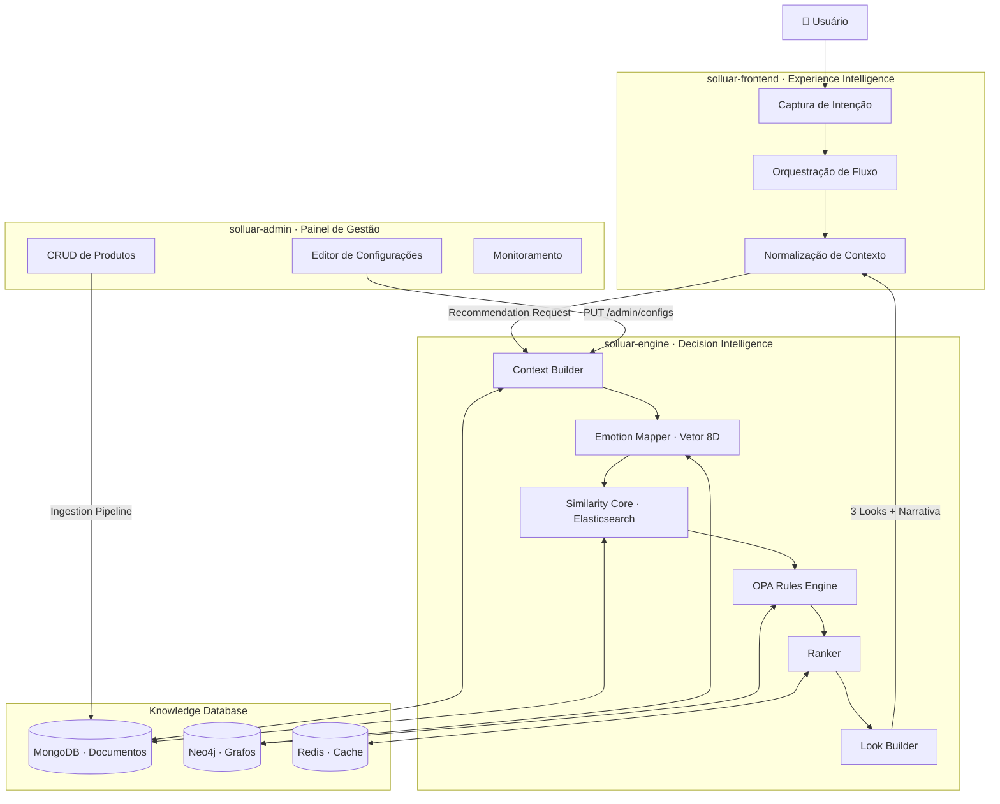

# Solluar

> **Traduzindo intenção humana em contexto. Transformando contexto em estilo.**

A **Solluar** é um ecossistema de inteligência para moda. Não um sistema de busca, não um catálogo de produtos — mas um motor que lê emoção, interpreta contexto e entrega **looks com significado**.

---

## ✦ Filosofia

> _"We value the Emotional Experience over raw algorithmic precision."_

Moda não é lógica pura. É uma linguagem de expressão que varia por humor, intenção, ambiente, período do dia. A Solluar foi construída com um princípio simples: a tecnologia deve servir a emoção, não o contrário.

O sistema organiza o mundo em **10 Categorias Sensoriais**, cada uma com um perfil emocional de 8 dimensões — Leveza, Brilho, Impacto, Vibração, Conforto, Ousadia, Sofisticação, Sensualidade. Toda recomendação nasce da interseção entre o contexto do usuário e a alma de uma categoria.

---

## ⟁ As Duas Inteligências

O ecossistema é dividido em duas inteligências complementares que nunca se misturam:

| Camada                                   | Responsabilidade                                         |
| :--------------------------------------- | :------------------------------------------------------- |
| **Experience Intelligence** — _Frontend_ | Capturar, estruturar e orquestrar a intenção humana      |
| **Decision Intelligence** — _Engine_     | Interpretar contexto, calcular vetores, recomendar looks |

```
Usuário → [Frontend] → Contexto Estruturado → [Engine] → 3 Looks com Narrativa
```

O Frontend estrutura. O Engine interpreta. As fronteiras são rígidas por design.

---

## 🏗️ Arquitetura do Ecossistema



---

## 🎨 As 10 Categorias Sensoriais

Cada categoria representa um arquétipo emocional distinto, definido por um perfil sensorial de 8 dimensões.

|  #  | Categoria                            | Essência                     | Contexto                                     |
| :-: | :----------------------------------- | :--------------------------- | :------------------------------------------- |
|  1  | **Use, Vista e Abuse**               | Bold · Energético · Poderoso | Baladas · Festas · Alto impacto              |
|  2  | **Experimente, Reinvente e Ascenda** | Criativo · Transformador     | Eventos de moda · Expressão criativa         |
|  3  | **Escolha, Combine e Pronto**        | Prático · Versátil           | Dia a dia · Trabalho casual · Fins de semana |
|  4  | **Ouse, Ilumine e Arrase**           | Radiante · Deslumbrante      | Red Carpet · Celebrações especiais           |
|  5  | **Monte, Compare e Decida**          | Analítico · Consciente       | Compras estratégicas · Decisões importantes  |
|  6  | **Simule, Ajuste e Valide**          | Experimental · Refinado      | Provas · Ajustes de estilo                   |
|  7  | **Harmonize, Eleve e Encante**       | Elegante · Equilibrado       | Eventos formais · Casamentos · Reuniões      |
|  8  | **Simplifique, Pureza e Equilíbrio** | Minimalista · Sereno         | Momentos zen · Escritório · Relaxamento      |
|  9  | **Sinta, Ilumine e Brilhe**          | Sensorial · Luminoso         | **Praia** · Piscina · Dias ensolarados       |
| 10  | **Explore, Conecte e Floresça**      | Natural · Fluido             | **Boho** · Viagens · Experiências outdoor    |

---

## 👗 A Estratégia dos 3 Looks

Cada recomendação resulta em **3 looks simultâneos**, cobridno o espectro completo de decisão:

| Look          | Estratégia   | Proporção                         | Objetivo                               |
| :------------ | :----------- | :-------------------------------- | :------------------------------------- |
| **Principal** | Equilibrada  | 60% Conforto / 40% Expressão      | O match perfeito para o contexto atual |
| **Seguro**    | Conservadora | 90% Conforto / 10% Novidade       | Atemporal, neutro e sem risco          |
| **Ousado**    | Expressiva   | 30% Conforto / 70% Experimentação | Alto contraste · Peças de impacto      |

> _"Refinar não é falhar. Refinar é exploração assistida."_

---

## 🛠️ Stack Tecnológica

### solluar-engine · Backend

| Tecnologia          | Papel                                    |
| :------------------ | :--------------------------------------- |
| **Python 3.12+**    | Linguagem principal                      |
| **FastAPI**         | API assíncrona                           |
| **MongoDB**         | Documentos: produtos, looks, templates   |
| **Neo4j**           | Grafos: relacionamentos, compatibilidade |
| **Elasticsearch**   | Busca vetorial semântica (k-NN)          |
| **Redis**           | Cache + Pub/Sub de configuração          |
| **OpenPolicyAgent** | Motor de regras de negócio (Rego)        |
| **Celery**          | Tarefas assíncronas pesadas              |
| **Hydra**           | Gerenciamento de configuração            |

### solluar-frontend · Experience Layer

| Tecnologia         | Papel                           |
| :----------------- | :------------------------------ |
| **React 19**       | UI declarativa                  |
| **Vite**           | Build e dev server ultra-rápido |
| **TypeScript**     | Tipagem e contrato com o Engine |
| **Zustand**        | Estado de fluxo transiente      |
| **Tailwind CSS 4** | Design system token-driven      |
| **Framer Motion**  | Animações de experiência        |

### solluar-admin · Management Panel

| Tecnologia          | Papel                                |
| :------------------ | :----------------------------------- |
| **React 19**        | UI declarativa                       |
| **React Router v7** | Roteamento com Loaders/Actions       |
| **Vite**            | Build e dev server                   |
| **TypeScript**      | Contratos alinhados com Engine       |
| **Tailwind CSS 4**  | Design consistente com o ecossistema |

---

## 📦 Repositórios

<table>
  <tr>
    <td align="center" width="33%">
      <h3>⚙️ solluar-engine</h3>
      <p>Motor de recomendação domain-driven.<br/>Python · FastAPI · KDB Dual-DB</p>
      <a href="https://github.com/Solluar/solluar-engine">
        
      </a>
      <a href="https://github.com/Solluar/solluar-engine">
        
      </a>
    </td>
    <td align="center" width="33%">
      <h3>🌊 solluar-frontend</h3>
      <p>Camada de experiência do usuário.<br/>Captura de intenção · Orquestração de fluxo · React</p>
      <a href="https://github.com/Solluar/solluar-frontend">
        
      </a>
      <a href="https://github.com/Solluar/solluar-frontend">
        
      </a>
    </td>
    <td align="center" width="33%">
      <h3>🎛️ solluar-admin</h3>
      <p>Painel de gestão do ecossistema.<br/>Configuração de pesos · CRUD · Monitoramento</p>
      <a href="https://github.com/Solluar/solluar-admin">
        
      </a>
      <a href="https://github.com/Solluar/solluar-admin">
        
      </a>
    </td>
  </tr>
</table>

---

## 📐 Princípios de Desenvolvimento

- **Clean Architecture** — Separação estrita entre domínio, infraestrutura e interface
- **Ports & Adapters** — Toda tecnologia externa via adaptadores intercambiáveis
- **Conventional Commits** — Rastreabilidade e changelog automatizável
- **Type Safety** — TypeScript no frontend, Type Hints obrigatórios no backend
- **Async First** — I/O bound → `async/await`; CPU bound → Celery Workers
- **Gatekeeper** — Nenhum dado entra no KDB sem passar pela validação do pipeline de ingestão
- **Boundary Enforcement** — Frontend nunca decide; Engine nunca renderiza

---

## 📄 Licença

MIT © 2026 [daniloleonecarneiro](https://github.com/daniloleonecarneiro)

---

<p align="center">
  <sub>Solluar — Structuring intent. Orchestrating experience. Delivering style.</sub>
</p>
